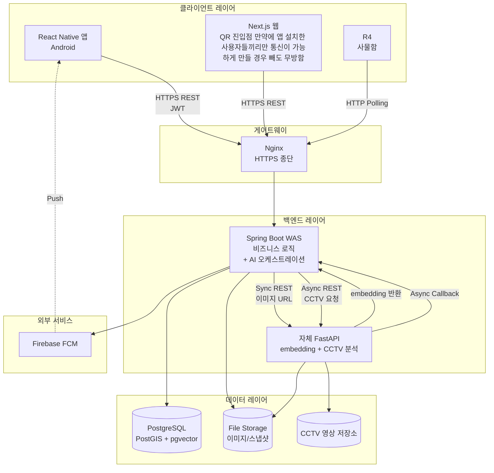

# Zoopick Backend

Zoopick은 명지대학교 자연캠퍼스를 대상으로 한 AI 기반 스마트 분실물
관리 시스템의 백엔드 서버입니다. 사용자가 업로드한 사진을 인공지능이
자동 분류·임베딩하고, CCTV 영상에서 객체 검출을 수행하여 분실물을
자동 매칭합니다. 매칭된 물품은 IoT 스마트 사물함을 통해 24시간 비대면
회수가 가능합니다.

본 레포지토리는 백엔드 서버(Spring Boot)만을 포함하며, 프론트엔드·AI·
하드웨어는 별도 레포지토리에서 관리됩니다.

---

## 목차
- [주요 기능](#주요-기능)
- [기술 스택](#기술-스택)
- [시스템 아키텍처](#시스템-아키텍처)
- [핵심 설계 결정](#핵심-설계-결정)
- [사전 요구 사항](#사전-요구-사항)
- [설치 및 실행](#설치-및-실행)
- [API 문서](#api-문서)
- [프로젝트 구조](#프로젝트-구조)
- [관련 레포지토리](#관련-레포지토리)

---

## 주요 기능

### AI 자동 분류 (A안 분석 흐름)
사용자가 사진을 업로드하면 백엔드가 AI 서버(FastAPI)에 동기 분석을
요청하여 카테고리·색상·임베딩을 받아옵니다. 사용자는 결과를 콤보박스로
검토·수정한 후 폼을 제출하므로, AI 오분류 시 사용자 단계에서 즉시
보정 가능합니다.

### 다축 매칭 점수 모델
분실(LOST)과 습득(FOUND) 신고 간의 매칭은 다음 4축 가중합 점수로
산정됩니다.
score = 0.30·category + 0.35·visual + 0.20·spatial + 0.15·temporal

매칭 임계값은 0.85이며, 시각 유사도(visual)는 pgvector의 HNSW 인덱스
기반 코사인 유사도로 계산됩니다.

### CCTV 사전 분석 워커
LOST 신고 시 사용자의 시간표 동선과 분실 추정 시각 ±2시간 윈도우를
교차하여 후보 영상을 결정하고, AI 워커(FastAPI)에 FIFO 큐로 적재합니다.
워커는 영상 1개씩 순차 처리하며(단일 워커 기반), 분석 완료 시 콜백을
통해 매칭 트리거가 발생합니다.

### All-or-Nothing 매칭 응답
사용자의 결과 조회 시점에 후보 영상이 모두 RESOLVED(COMPLETED 또는
FAILED)인 경우에만 매칭 결과를 반환합니다. 미완료 시 "약 N분 후
다시 시도해주세요" 안내와 함께 estimatedRemainingSeconds를 응답하며,
분석 완료 시점에 FCM 푸시 알림이 발송됩니다.

### 스마트 사물함 (IoT)
Arduino UNO R4 WiFi 기반 사물함 제어. 1초 간격 HTTP 폴링으로
locker_commands 큐를 조회하며, 12V 솔레노이드 락의 Fail-Safe 결선으로
정전 시에도 잠금이 유지됩니다.

### 실시간 채팅 및 알림
- WebSocket (STOMP + Simple In-Memory Broker) 기반 실시간 채팅
- 오프라인 사용자에게는 FCM 푸시 보완
- notifications 테이블에 영구 저장하여 푸시 도달 실패에 대비

---

## 기술 스택

### Backend
- **Framework**: Spring Boot 3.4.1 (Java 17)
- **Database**: PostgreSQL 16 + pgvector (HNSW 인덱스)
- **Cache/Session**: Redis 7 (임베딩 캐시, 매칭 점수 캐시, 멱등성 키)
- **Security**: Spring Security, JWT (Bearer)
- **Messaging**: WebSocket (STOMP), Firebase Cloud Messaging (FCM)
- **Documentation**: Springdoc OpenAPI (Swagger UI)

### 외부 컴포넌트 (별도 레포)
- **AI Server**: FastAPI + CLIP ViT-B/32 + YOLO11s
    - 사진: CLIP 단독 분석
    - 영상: YOLO11s 객체 검출 후 검출 객체에 CLIP 적용
- **Frontend**: React Native (Android)
- **IoT**: Arduino UNO R4 WiFi + 12V 솔레노이드 락 (SM1054S 원형헤드)

---

## 시스템 아키텍처


상세 아키텍처와 데이터 흐름은 [상세설계 보고서] 참조.

---

## 핵심 설계 결정

본 시스템의 주요 설계 결정과 그 근거 

| 영역 | 결정 | 핵심 근거 |
|------|------|---------|
| DB 엔진 | PostgreSQL + pgvector | 임베딩 벡터 검색 네이티브 지원 |
| 임베딩 인덱스 | HNSW | 검색 속도와 정확도의 균형 |
| AI 분석 흐름 | 업로드 → 분석 → 검토 → 제출 | AI 오분류 시 사용자 단계 보정 가능 |
| CCTV 워커 | 단일 워커 FIFO | 단일 GPU 환경에서 컨텍스트 경합 회피 |
| 매칭 정책 | All-or-Nothing | 부분 결과 노출의 사용자 인지 오류 회피 |
| 매칭 점수 보관 | Redis (DB 컬럼 X) | 영구 보존 불필요, DB 부하 분리 |
| 인증 계층 | JWT  | 컴포넌트별 자원 제약 차등 적용 |
| 채팅 통신 | STOMP + In-Memory Broker | 단일 머신 시연 환경에서 과설계 회피 |
| FCM 발송 시점 | completed 콜백에서만 | progress 콜백 다발성으로 인한 spam 회피 |

---

## 사전 요구 사항

| 구성 요소 | 최소 버전 |
|---------|--------|
| Java | 17 |
| PostgreSQL | 16 (pgvector 확장 필수) |
| Redis | 7 |
| Maven | 3.8 (또는 Maven Wrapper 사용) |

추가 외부 의존성:
- Firebase Admin SDK 서비스 계정 키 (.json 파일)
- FastAPI AI 서버 URL (별도 레포에서 실행)

---

## 설치 및 실행

### 1. 환경 변수 설정

프로젝트 루트에 `.env` 파일을 생성합니다.

```properties
# Database
SPRING_DATASOURCE_URL=jdbc:postgresql://localhost:5432/zoopick
SPRING_DATASOURCE_USERNAME=your_username
SPRING_DATASOURCE_PASSWORD=your_password

# Mail (회원가입 인증 메일 발송)
SPRING_MAIL_USERNAME=your_email@gmail.com
SPRING_MAIL_PASSWORD=your_app_password

# JWT (32자 이상 권장)
JWT_SECRET=your_jwt_secret_key_at_least_32_characters

# 외부 연동
FIREBASE_ACCOUNT_KEY_PATH=path/to/firebase-adminsdk.json
FASTAPI_BASE_URL=http://localhost:8000

# 내부 콜백 인증 토큰 (AI 서버와 공유)
INTERNAL_CALLBACK_TOKEN=shared_secret_token

# 파일 저장 경로
FILE_STORAGE_ROOT=/var/mju-lostfound
```

### 2. 데이터베이스 초기화

```bash
# 데이터베이스 생성
createdb -U postgres zoopick

# pgvector 확장 활성화
psql -U postgres -d zoopick -c "CREATE EXTENSION IF NOT EXISTS vector;"

# 스키마·시드 적용
psql -U postgres -d zoopick -f zoopick_dump.sql
```

### 3. 빌드 및 실행

```bash
# 빌드
./mvnw clean package

# 실행
java -jar target/zoopick-server-0.0.1.jar
```

기본 포트는 8080이며, `SERVER_PORT` 환경 변수로 변경 가능합니다.

---

## API 문서

서버 실행 후 Swagger UI에서 전체 API 명세를 확인할 수 있습니다.

- **Swagger UI**: http://localhost:8080/swagger-ui/index.html
- **OpenAPI JSON**: http://localhost:8080/v3/api-docs

### 주요 엔드포인트 그룹

| 그룹 | 경로 prefix | 인증 | 설명 |
|------|-----------|----|------|
| 인증 | /api/auth/* | Public | 로그인, 회원가입 |
| 사용자 | /api/users/* | JWT | 프로필, 시간표 관리, QR 발급 |
| 신고 | /api/items/* | JWT | 사진 업로드(A안), 신고 등록, 게시판 |
| 매칭 | /api/item-matches/* | JWT | 자동·수동 매칭 결과 |
| CCTV | /api/cctv/* | JWT | 분석 결과 조회, 검출 검토 |
| 사물함 | /api/lockers/* | JWT | QR 스캔, 잠금 해제 |
| 채팅 | /api/chat-rooms/* | JWT | 방 생성, 메시지 |
| WebSocket | /ws/* | JWT (CONNECT) | 실시간 STOMP |
| 알림 | /api/notifications/* | JWT | 알림 목록, 읽음 처리 |
| Arduino | /api/lockers/{id}/pending, /ack | Device Token | 사물함 명령 폴링 |
| 내부 콜백 | /api/internal/cctv/* | Internal Token | AI 서버 콜백 (detection/completed/failed/progress) |

전체 60여 개 엔드포인트의 상세 명세는 [상세설계 보고서 부록 B] 참조.

---

## 프로젝트 구조


---

## 관련 레포지토리

- **Frontend (React Native)**: [zoopick-app] (별도 레포)
- **AI Server (FastAPI)**: [zoopick-ai] (별도 레포)
- **Firmware (Arduino)**: [zoopick-firmware] (별도 레포)

---

## 문서

- **상세설계 보고서**: docs/zoopick-design-report.pdf (캡스톤 보고서)
- **ADR (의사결정 기록)**: 상세설계 보고서 부록 D
- **API 명세 요약**: 상세설계 보고서 부록 B

---

## 라이센스 및 소속

본 프로젝트는 명지대학교 자연캠퍼스 컴퓨터공학과 캡스톤 설계 산출물입니다.
교육·연구 목적으로 자유롭게 활용 가능합니다.